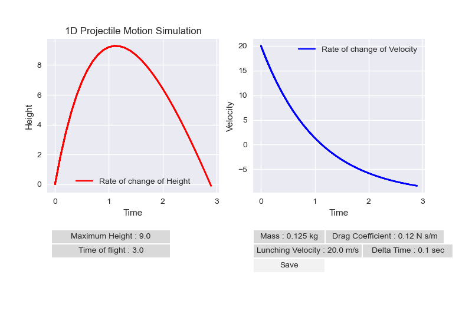

# 1D Projectile Motion Simulation

This code simulates the 1D projectile motion of a particle considering drag force. It calculates and plots the height and velocity of the particle over time using numerical integration.

## Requirements

- Python 3.x
- NumPy
- Matplotlib
- SciPy

## Usage

1. Run the code using a Python interpreter.
2. Enter the following parameters when prompted:
   - Mass of the particle (in kg)
   - Drag coefficient (in N sec/m)
   - Launching velocity of the particle (in m/s)
   - Delta T (recommended values: 0.5 to 0.01)
3. The simulation will run and display a plot with two subplots: height vs. time and velocity vs. time.
4. The maximum height and time of flight will be displayed as buttons on the plot.
5. You can save the plot as an image by clicking the "Save" button.

## Results

The simulation will generate a plot showing the height and velocity of the particle as a function of time. The plot provides insights into the projectile motion, including the maximum height reached and the time of flight.

## Customization

The code can be customized to change the initial conditions, simulation parameters, or plot appearance according to specific requirements. Modify the code as needed and rerun the simulation.

## Acknowledgements

This code is provided as a starting point for simulating 1D projectile motion with drag force. It can be extended and enhanced for more complex simulations or specific use cases.

## License

This code is released under the MIT License. Please refer to the LICENSE file for more details.

